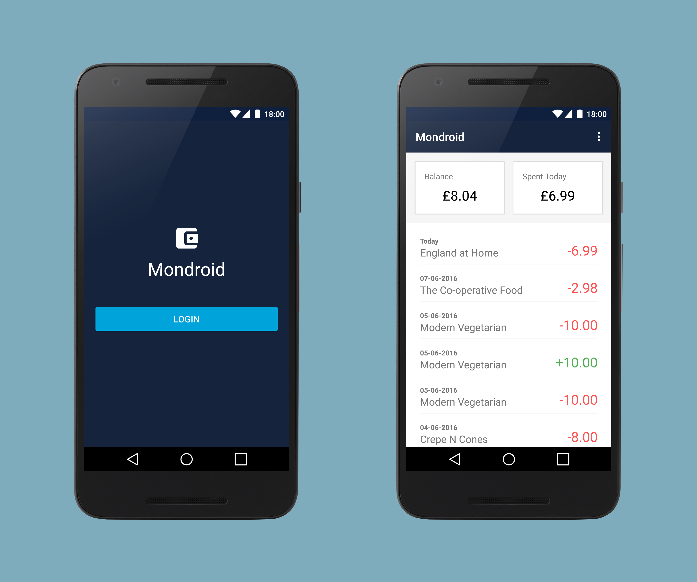

Mondroid
========

    

Mondroid is an unofficial [Mondo](https://getmondo.co.uk/) Android Client. It allows you to:

- Login to your Mondo account via oAuth
- View your account balance and todays spend
- View a list of your transactions

Mondo are due to release an Android app over the coming months, so I quickly put this together
for the meantime. Because of this, I haven't spent too much time building it so there's bound to be
some bugs etc.

In-order to use this app, you'll need to setup a few things first:

- You'll need a [Mondo](https://getmondo.co.uk/) card, you can't use this application without one.
- Sign in to the [Mondo Developer Console] (https://developers.getmondo.co.uk/) and create a new Client.
- In the gradle.properties file of this project, replace the clientId and clientSecret with your client values

And now you should be all set 🐵

Requirements
------------

 - [Android SDK](http://developer.android.com/sdk/index.html).
 - Android [5.0 (API 21) ](http://developer.android.com/tools/revisions/platforms.html#5.0).
 - Android SDK Tools
 - Android SDK Build tools 23.0.3
 - Android Support Repository
 - Android Support libraries

Building
--------

To build, install and run a debug version, run this from the root of the project:

    ./gradlew assembleDebug

Testing
-------

For example I've included a couple of unit and functional tests, these can be run using:

Unit tests can be run using:

    ./gradlew testDebugUnitTest

and functional tests:

    ./gradlew connectedDebugAndroidTest
